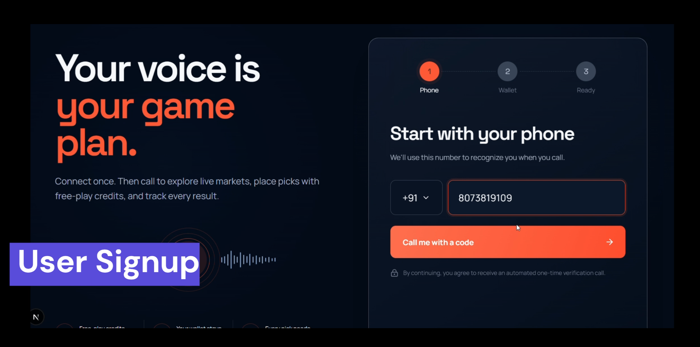
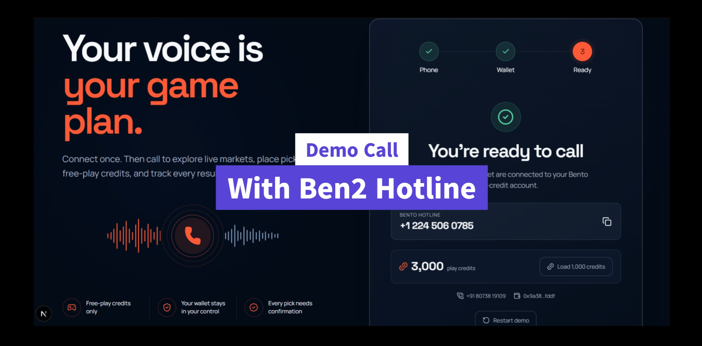
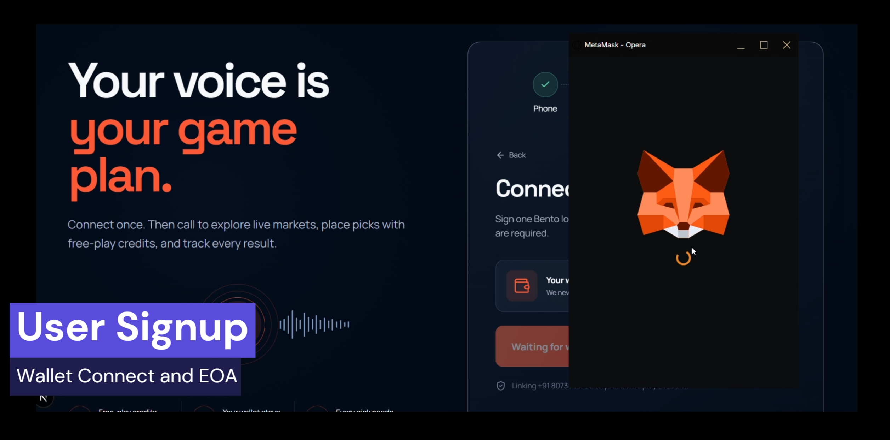

# Project name

> Copy this folder to `submissions/YourTeamName/` and fill every section below.

## Project

| Field | Your answer |
|-------|-------------|
| **Project name** | Bento Bookie |
| **Tagline** | A conversational, high-energy AI voice agent that lets users discover and participate in Bento prediction markets over a phone call. |
| **Team name** | DARQLords |
| **Team members** | Pawan Ajjar K, Sam Christian |
| **Contact email** | infantsamchris@gmail.com |
| **Track** (if applicable) | AI Agents |


### Links

| | URL |
|---|-----|
| **Live demo** | NA |
| **Demo video** (≤2 min) or slide deck | [Demo Video](https://youtu.be/iXcLU55zG1g) |
| **Pitch deck** (optional) | [Deck](https://docs.google.com/presentation/d/105NyyigFgBG0wtlIlvA01RFtIYyslT9w/edit?usp=sharing&ouid=112963053860725712385&rtpof=true&sd=true)|

---

## What you built

Bento Hotline is a conversational AI voice hotline built for everyday sports fans, traders, and crypto enthusiasts who want to participate in prediction markets without the friction of complex web interfaces. It solves the accessibility and convenience problem in decentralized finance by allowing anyone to simply dial a phone number, ask about live events, and securely place bets using natural language while on the go. Under the hood, it uses the `@bento.fun/sdk` to map the caller's OTP-verified phone number to an encrypted Bento managed account session. The autonomous LangGraph agent leverages Bento's API as native tools to query live duels, estimate buy prices, fetch share balances, and execute    on-chain prediction trades on behalf of the user. It even enables callers to create their own public duels or mint testnet play credits simply by speaking, bringing a fully hands-free prediction market experience to the masses.


### Screenshots

<div align="center">
  
  <br/><br/><br/>
  
  <br/><br/><br/>
  
</div>

---

## Bento integration

For each surface: put **Yes** or **No**. If Yes, briefly describe how (SDK methods, feature, etc.).

| Surface | Yes / No | Describe (if Yes) |
|---------|----------|-------------------|
| Markets / duels (browse, bet, create) | **Yes** | Uses `sdk.public.listDuels`, `sdk.public.listMarkets`, `sdk.public.getDuelById`, `sdk.user.estimateBuy`, `sdk.user.placeBetFromEstimate`, `sdk.user.createDuel`, and `sdk.user.getUserShares` to provide a full voice-operated market experience. |
| Multi-outcome / parent markets | **No** | |
| Parlays | **No** | |
| Tournaments / F1 / fantasy | **No** | |
| Packs | **No** | |
| Polymarket bridge | **No** | |
| Agents | **Yes** | Built a fully autonomous Langchain agent that uses Bento SDK operations as tools (`DynamicStructuredTool`) to read markets, price bets, and execute transactions on behalf of the user's managed account. |
| Realtime / social | **No** | |
| Others | **Yes** | Integrated **Authentication** (`sdk.public.auth.eoaLogin`, `sdk.public.auth.eoaRegister`) to link user EOA wallets to Bento managed accounts, and the **Faucet** (`sdk.public.autoMint.mint`) to let users top up their play credits via voice command. |


**Builder API key:** minted from [docs.bento.fun - Builder API key](https://docs.bento.fun/concepts/builder-api-key) (testnet). Do **not** commit keys.

---

## How to run

# from this folder, or link to your external repo
```bash
cp .env.example .env   # fill env vars
npm install            # or pnpm / yarn
npm run dev
npm run voice
```

| Env var | Required | Description |
|---------|----------|-------------|
| `BENTO_BUILDER_API_KEY` | yes | Testnet builder key |
| `BENTO_URL` | yes | Markets host (`https://internal-server.bento.fun`) |
| `TWILIO_ACCOUNT_SID` | yes | Twilio Account SID |
| `TWILIO_AUTH_TOKEN` | yes | Twilio Auth Token |
| `TWILIO_API_KEY_SID` | yes | Twilio API Key SID |
| `TWILIO_API_KEY_SECRET` | yes | Twilio API Key Secret |
| `TWILIO_VERIFY_SERVICE_SID` | yes | Twilio Verify Service SID (used for OTP auth) |
| `NEXT_PUBLIC_HOTLINE_NUMBER` | yes | The public phone number for the voice hotline |
| `TWILIO_CALLER_NUMBER` | yes | Twilio caller number |
| `MONGODB_URI` | yes | MongoDB connection string to store user account links |
| `PHONE_HASH_SALT` | if needed | Fallback salt for encryption |
| `OTP_BYPASS_CODE` | if needed | Code used to bypass OTP during testing |
| `OTP_BYPASS_NUMBERS` | if needed | Phone numbers that can bypass OTP during testing |
| `OPENAI_API_KEY` | yes | OpenAI API key for the Langchain conversational agent |
| `BENTO_TOKEN_ENC_KEY` | yes | Secret string to encrypt Bento session tokens in the database |
| `ANAKIN_API_KEY` | yes | Anakin API key |

---


## Architecture (short)

- **Stack:** Next.js (React), Express (Node.js WebSocket Server), LangChain (LangGraph), OpenAI (`gpt-5.6-luna`), Twilio (Voice & Verify), MongoDB, and the `@bento.fun/sdk`.
- **Repo layout:** 
  - `server/`: Standalone Express & WebSocket server for handling the real-time Twilio ConversationRelay stream.
  - `app/`: Next.js frontend and API routes for onboarding and OTP verification.
  - `lib/agent/`: Core LangGraph agent logic, system prompts, and tools.
  - `lib/`: Shared services (Bento SDK abstractions, MongoDB adapter, AES encryption, Twilio utilities).
- **Auth:** Uses **Twilio Verify** to authenticate callers via OTP and links their E.164 phone number to their Web3 EOA wallet in MongoDB. It seamlessly registers/authenticates the wallet via `bento.fun`'s `eoaLogin`/`eoaRegister` and encrypts the resulting session token (AES-256-GCM) at rest.
- **What's on-chain vs off-chain:**
  - **On-chain:** Duel creations, prediction market bets, wallet collateral (play credits), and share balances (all executed securely via the Bento managed account).
  - **Off-chain:** Phone number linking, chat history, LLM agent reasoning, live Twilio audio streaming, and staging pending bets prior to user confirmation.
