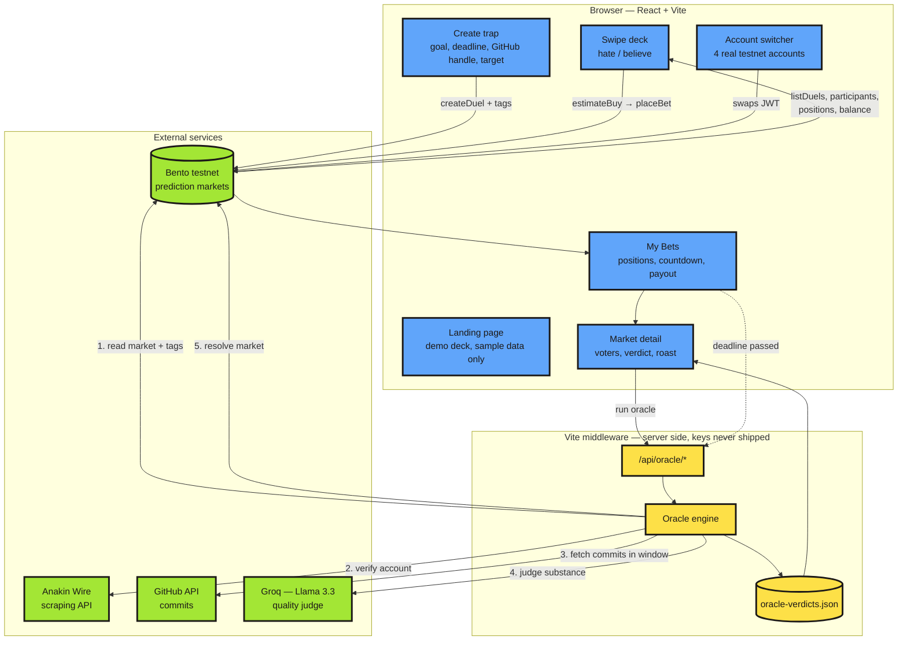

## SpiteBet

### Architecture

**The loop:** create a trap → it mints a real Bento prediction market → friends swipe to bet
real testnet credits → at the deadline the oracle scrapes the evidence, an AI judges whether
the work was *substantive* (ten README typo commits do not count) → the market resolves and
the winning side takes the pool.

> **Verification is currently GitHub-only.** The oracle can genuinely check commit counts and
> commit quality for any public GitHub account. Strava, Screen Time, gym check-ins, and
> photo-based proof are selectable in the create flow but are not yet wired to a real data
> source — those traps are recorded and bet on, but resolve as `unverifiable`. Adding a new
> verifier means writing one evidence-gathering function; the AI judging layer is generic and
> already handles any activity list.

SpiteBet is a social accountability app built on Bento testnet. It turns daily goals into prediction-style traps so friends can bet against you or back you using fake internet money, then lets an AI oracle judge the result later.

### What it does
- Create a trap for a real goal like “run 5km,” “ship 5 commits,” or “finish a habit.”
- Let friends swipe to bet `Hate` or `Believe` on the outcome.
- Track positions, balances, and market activity inside the app.
- Use the Bento testnet flow for signing in, creating markets, and placing bets.
- Keep everything playful and public without touching real money.

### How it works
- A user creates a market with a goal, handle, category, verification method, and deadline.
- That market appears in the swipe deck where other users place bets.
- The app keeps the Bento-backed positions and vote breakdowns in sync with the UI.
- When the deadline passes, the oracle can check whether the goal was completed and resolve the market.
- The My Bets page shows your live positions, PnL, time left, and who actually started the market.

### Main screens
- Landing page: explains the product, shows the deck preview, leaderboard, flow, categories, and FAQ.
- App page: the working product shell with the deck, create-market flow, and My Bets portfolio.
- Swipe deck: the core betting experience, built for fast left/right decisions.
- Create market: lets a user launch a new trap with verification details.
- My Bets: shows your active Bento positions, summary stats, and market-level voter breakdowns.

### Product feel
- Neo-brutalist visual language with bold borders, bright accent colors, and chunky cards.
- Designed to feel fast, funny, and slightly ruthless.
- Responsive layout for desktop and phones.
- Sticky navigation and compact controls so the app stays usable while scrolling.

### Tech stack
- React 19
- TypeScript
- Vite
- Tailwind CSS v4
- lucide-react icons
- framer-motion for motion on the landing page
- Bento SDK and Bento testnet APIs

### Bento modules used
- `fetchSpiteMarkets()` loads the live market list from Bento.
- `fetchVotes()` gets the real hater/believer breakdown for each market.
- `fetchAccount()` pulls portfolio totals and balances.
- `fetchPositions()` loads the active on-chain positions shown in My Bets.
- `createTrap()` creates a new Bento market from the Create Market flow.
- `placeSpiteBet()` submits a hate or believe bet to Bento.
- `claimFaucet()` mints testnet credits for demo accounts.
- `getStoredToken()`, `getAddressFromToken()`, `isConfigured()`, and `setActiveAccountName()` keep the Bento session and account switching in sync.

