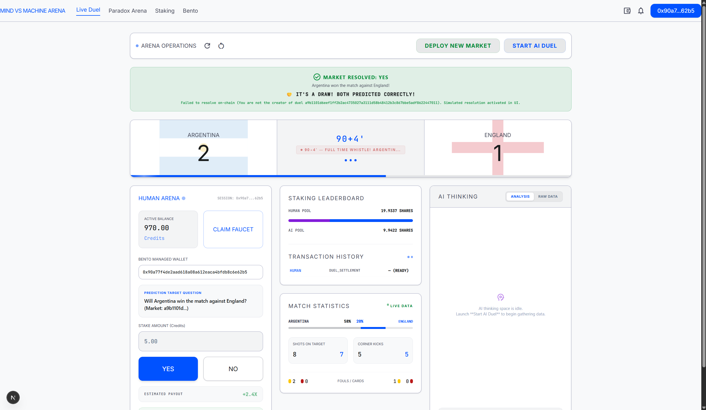
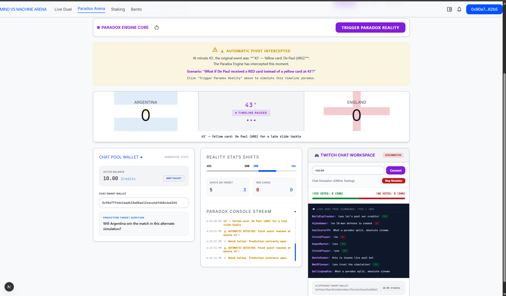
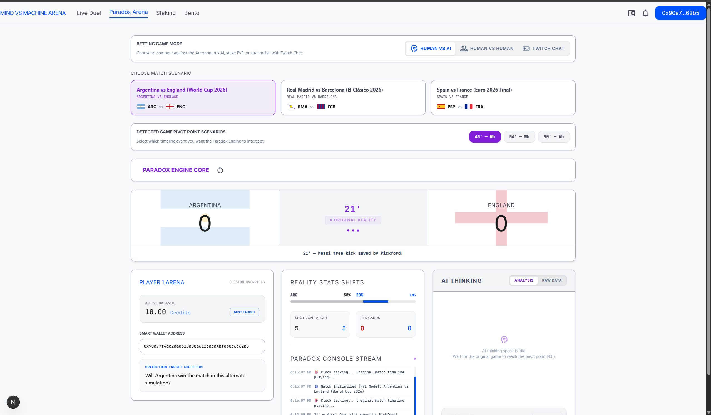

# Project: Paradox Arena

## Project

| Field | Your answer |
|-------|-------------|
| **Project name** | Paradox Arena |
| **Tagline** | Alternate reality sports prediction dueling powered by AI agent smart wallets and Twitch Chat pooling. |
| **Team name** | team paradox?
| **Team members** | Vishwas Naveen
| **Contact email** | vishwas.naveen2580@gmail.com
| **Track** (if applicable) | AI Agents / Real-time Staking / Sports Betting |

### Links

| | URL |
|---|-----|
| **Live demo** | http://localhost:3000 | ye nuh uh
| **Demo video** https://drive.google.com/file/d/1k5plmDHZ4CQMbWxyl5SFyYYqOrVsV18R/view?usp=sharing
| **Pitch deck** (optional) | [Fill Pitch Deck URL] |

---

## What you built

Paradox Arena is a real-time on-chain sports gaming platform where users and live stream audiences can bet on the outcomes of alternate soccer matches. The platform automatically intercepts historical games at critical pivot points (e.g. red cards, hit posts, disallowed goals) and spins up simulated "sliding door" realities using AI agent reasoning. Users can stake their predictions locally or connect Twitch Chat via WebSockets to pool viewer votes into collective smart-account bets. Behind the scenes, the game deploys real-time private prediction markets using the Bento SDK on the Base Sepolia testnet, places transactions for both the player's and the AI agent's smart accounts, and resolves outcomes on-chain at the final whistle.

### Screenshots

Add 2-4 screenshots or GIFs under `./assets/` and embed them here.

```
<!--  -->
<!--  -->
<!--  -->
```

---

## Bento integration

For each surface: put **Yes** or **No**. If Yes, briefly describe how (SDK methods, feature, etc.).

| Surface | Yes / No | Describe (if Yes) |
|---------|----------|-------------------|
| Markets / duels (browse, bet, create) | **Yes** | Uses `sdk.user.createDuel` to dynamically deploy custom alternate timelines as private markets, `sdk.user.placeBet` to place stakes of 5.00 credits on behalf of human and AI smart accounts, and `sdk.user.duels.resolve` to settle the outcome on-chain. |
| Multi-outcome / parent markets | **No** | |
| Parlays | **No** | |
| Tournaments / F1 / fantasy | **No** | |
| Packs | **No** | |
| Polymarket bridge | **No** | |
| Agents | **Yes** | Incorporates an autonomous AI Sports Analyst Agent that reads simulated match timelines, executes predictive evaluations via upstream OpenRouter Large Language Models, and places opposing stakes on-chain. |
| Realtime / social | **Yes** | Connects to real-time Twitch stream chat via WebSockets (`wss://irc-ws.chat.twitch.tv`), aggregating viewer `!yes`/`!no` commands into a single pooled smart-account bet. |
| Others | **No** | |

**Builder API key:** minted from [docs.bento.fun - Builder API key](https://docs.bento.fun/concepts/builder-api-key) (testnet). Do **not** commit keys.

---

## How to run

```bash
# from this folder, or link to your external repo
cp .env.example .env   # fill env vars
npm install            # or pnpm / yarn
npm run dev
```

| Env var | Required | Description |
|---------|----------|-------------|
| `BENTO_BUILDER_API_KEY` | yes | Testnet builder key |
| `BENTO_URL` | yes | Markets host (`https://internal-server.bento.fun`) |
| `HUMAN_JWT` | yes | User smart wallet authentication token |
| `AI_JWT` | yes | AI Agent smart wallet authentication token |
| `HUMAN_ADDRESS` | yes | User smart wallet address |
| `AI_ADDRESS` | yes | AI Agent smart wallet address |
| `OPENROUTER_API_KEY` | yes | API key for LLM timeline prediction models |

---

## Architecture (short)

- **Stack:** Next.js 16 (App Router), React 19, TypeScript, Vanilla CSS, Bento SDK (`@bento.fun/sdk`), OpenRouter API.
- **Repo layout:**
  - `src/app/page.tsx`: Home dashboard representing the Live AI Duel lobby.
  - `src/app/paradox-arena/page.tsx`: The main visual game loop containing selectable soccer match timelines, pivot intercepts, and the Twitch console integration.
  - `src/app/api/create-market/route.ts`: API handler to dynamically create prediction markets on Bento testnet.
  - `src/app/api/human-bet/route.ts`: API handler to place human smart account positions.
  - `src/app/api/ai-bet/route.ts`: API handler to place AI agent smart account positions.
  - `src/app/api/resolve-duel/route.ts`: API handler to settle markets on-chain upon timeline completion.
  - `src/app/api/paradox-simulate/route.ts`: Integrates with LLM simulation queries to draft alternate timelines.
  - `scripts/`: Local scripts to test environment variables, list current duels, and verify network base URLs.
- **Auth:** Wallet sign-ins are handled via verified JSON Web Tokens (`HUMAN_JWT` and `AI_JWT`) generated through signature handshakes and injected into SDK authorization providers.
- **What's on-chain vs off-chain:**
  - **On-chain:** Bento prediction market contract deployments, player bets, AI opposing bets, chat pooled stakes, and contract resolution/settlement.
  - **Off-chain:** Live timeline calculations, alternate reality soccer simulations, Twitch WebSocket IRC log stream parsing, and local client credit metrics.
