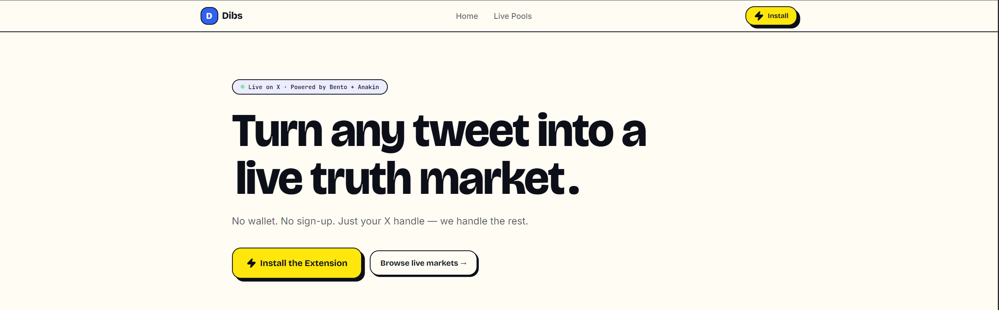
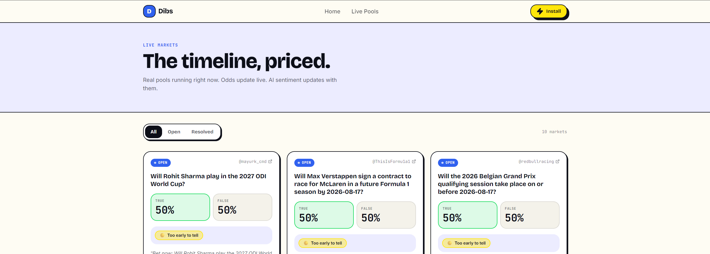

# Dibs

> ⚡ Turn any tweet into a live truth market

## Project

| Field | Your answer |
|-------|-------------|
| **Project name** | Dibs |
| **Tagline** | Turn any tweet into a live truth market |
| **Team name** | web3peeps |
| **Team members** | Mayur Kulkarni |
| **Contact email** | mayurgk2006@gmail.com |
| **Track**  | Bento + Anakin |


### Links

| | URL |
|---|-----|
| **Live demo** | `chrome://extensions/` → Load unpacked → `extension/` vercel: https://dibs-sand.vercel.app/ (in demo the install button does not work (i will publish the extension later))|
| **Demo video** (≤2 min) or slide deck | — |
| **Pitch deck** (optional) | https://drive.google.com/drive/folders/1fS1Sa3eUpLKRKD8jJk-p4NdxQm05o-5F?usp=sharing |

---

## What i built

Dibs is a Chrome extension that lets anyone turn a tweet into a prediction market in one click. No wallet, no sign-up — just your X handle.

It solves two problems: (1) making on-chain prediction markets accessible to people who've never touched crypto, and (2) surfacing AI-researched context — not just odds — so users bet informed.

The extension scans X/Twitter, injects a ⚡ button on each tweet. Click it, AI converts the claim into a binary (yes/no) question, researches it via Anakin, and publishes the market on Bento testnet. Other users see live odds, get an AI prediction (YES/NO with confidence), and place bets — all inside the tweet itself.

### Screenshots





---

## Bento integration

| Surface | Yes / No | Describe (if Yes) |
|---------|----------|-------------------|
| Markets / duels (browse, bet, create) | **Yes** | `sdk.public.managedAccount.create` — custodial wallets per user; `createBentoSdk` with `collateralMode: 'credits'`; `sdk.public.duels.createClaimDuel` — create binary markets; `sdk.user.bets.estimateBuy` → `sdk.user.bets.placeBet` — two-step betting flow; `sdk.public.bets.getDuelById` — poll for settlement |
| Multi-outcome / parent markets | No | |
| Parlays | No | |
| Tournaments / F1 / fantasy | No | |
| Packs | No | |
| Polymarket bridge | No | |
| Agents | No | |
| Realtime / social | Yes | works live on X fully tested |
| Others | No | |

**Builder API key:** minted from [docs.bento.fun - Builder API key](https://docs.bento.fun/concepts/builder-api-key) (testnet). Do **not** commit keys.

---

## How to run

```bash
# Backend
cd backend
cp .env.example .env   # fill env vars
npm install
npm start              # runs on localhost:3000

# Extension (separate terminal)
# Go to chrome://extensions/ → Developer mode → Load unpacked → select extension/
```

| Env var | Required | Description |
|---------|----------|-------------|
| `BENTO_BUILDER_API_KEY` | yes | Testnet builder key |
| `BENTO_URL` | yes | Markets host (`https://internal-server.bento.fun`) |
| `ANAKIN_API_KEY` | yes | Anakin agentic search |
| `OPENROUTER_API_KEY` | yes | OpenRouter (`tencent/hy3:free`) |
| `MONGODB_URI` | yes | MongoDB Atlas |
| `PORT` | yes | `3000` |

---

## Architecture (short)

- **Stack:** Node.js + Express backend, vanilla JS Chrome extension, MongoDB Atlas
- **Repo layout:**
  - `backend/` — Express API, Bento SDK integration, Anakin research, OpenRouter AI
  - `extension/` — Manifest V3 extension: content script, background worker, popup
  - `frontend/` — React + TanStack landing/pools page
  - `docs/` — Spec docs, testing notes
- **Auth:** X handle only. Backend creates custodial EVM wallets + Bento managed accounts server-side. No wallet popups, no seed phrases.
- **What's on-chain vs off-chain:** Markets (duels), bets, and resolution live on Bento testnet. AI claim validation, Anakin research, user stats, and market metadata are off-chain in MongoDB.
